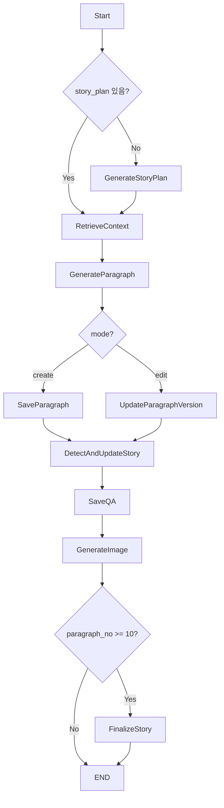

# LangGraph 서비스 구조 가이드

> 동화 생성 시스템의 LangGraph 기반 워크플로우 모듈

<br>

## 📁 디렉토리 구조

```
langgraph/
├── __init__.py              # 모듈 초기화 및 공통 exports
├── story_flow.py           # ⭐ 메인 플로우 정의
├── core_nodes.py           # ⭐ 핵심 생성 노드들
├── routers.py              # 🔀 분기 함수들 
├── character_utils.py      # 👥 등장인물 관리
├── paragraph_utils.py      # 📝 문단 저장/버전 관리
├── image_utils.py          # 🖼️ 이미지 생성
├── summary_utils.py        # 📋 요약 및 스토리 업데이트
├── parsing_utils.py        # 🔧 텍스트 파싱 유틸
├── finalize_utils.py       # 🏁 동화 완성 처리
├── substage_prompts.py     # 📝 각 단계별 프롬프트 가이드
├── node_img.py             # 🖼️ 이미지 생성 통합 함수
└── backup/
    └── nodes_backup.py     # 🗄️ 백업 파일
```

<br>

## 🔄 메인 플로우 (story_flow.py)

<br>

### StoryState 구조
동화 생성 중 상태를 관리하는 TypedDict입니다.

```python
class StoryState(TypedDict, total=False):
    # 기본 정보
    user_id: int                    # 사용자 ID
    story_id: int                   # 동화 ID  
    age: int                        # 사용자 연령
    
    # 스토리 내용
    story_plan: list[str]          # 10단계 기승전결 요약
    input: str                     # 사용자 입력
    theme: str                     # 테마 (고전, 판타지 등)
    mood: str                      # 분위기 (따뜻한, 신비로운 등)
    
    # 문단 관련
    paragraph_id: int              # 문단 ID
    paragraph_no: int              # 문단 번호 (1~10)
    paragraph_text: str            # 생성된 문단 텍스트
    version_no: int                # 버전 번호
    
    # 생성 모드
    mode: Literal["create", "edit", "start", "end"]
    
    # 이미지/질문
    image_url: str                 # 이미지 URL
    question: str                  # AI 질문
    choices: str                   # 선택지
    
    # 기타
    context: str                   # 벡터 검색 문맥
    continue_story: bool           # 계속 생성할지 여부
```

<br>

### 플로우 다이어그램



<br>

```ruby
# 플로우 다이어그램:
 Start
   ↓
 GenerateStoryPlan
    ├── (story_plan 있음) → RetrieveContext
    └── (없음)            → GenerateParagraph
         ↓
 RetrieveContext
         ↓
 GenerateParagraph
    ├── mode == "create" → SaveParagraph
    └── mode == "edit"   → UpdateParagraphVersion
         ↓
 SaveParagraph / UpdateParagraphVersion
         ↓
 DetectAndUpdateStory
         ↓
       SaveQA
         ↓
 GenerateImage
    ├── paragraph_no < 10 → __end__
    └── paragraph_no ≥ 10 → FinalizeStory
                              ↓
                            [END]

```

<br>

## 🎯 핵심 노드들 (core_nodes.py)

<br>

### 1. generate_story_plan
- **기능**: 10단계 기승전결 요약 생성
- **입력**: theme, mood, topic, age
- **출력**: story_plan (10개 문장), characters
- **특징**: DB에 summary_4step과 characters 저장

<br>

### 2. retrieve_context  
- **기능**: 관계형 DB에서 이전 문맥 조회
- **입력**: story_id, input (키워드)
- **출력**: context (이전 문단들)
- **특징**: 첫 문단은 context 비움, 11번째 문단 요청 시 거부

<br>

### 3. generate_paragraph
- **기능**: 메인 문단 생성 함수
- **입력**: user_input, context, story_plan
- **출력**: paragraph_text, question, choices
- **특징**: 
  - 10단계별 세부 가이드 적용
  - 10번째 문단은 강제 종료 (질문/선택지 없음)
  - Chain of Thought 기반 사고 흐름 유도

<br>

## 👥 등장인물 관리 (character_utils.py)

<br>

### 통합 함수: extract_and_describe
**성능 최적화**: 기존 3개 함수를 1개로 통합하여 API 호출 1/3로 단축

```python
def extract_and_describe(text: str, user_input: str, known_names: list[str], age: int) -> dict:
    """
    새로운 캐릭터 추출 + 프로필 생성을 한 번에 처리
    Return: {"new_characters": [{"name": "이름", "description": "프로필"}]}
    """
```

<br>

### 레거시 함수들 (호환성용)
- `extract_new_characters`: 새 캐릭터 이름만 추출
- `filter_significant_characters`: 의미 있는 캐릭터만 필터링  
- `get_character_description`: 캐릭터 프로필 생성

<br>

## 📝 문단 관리 (paragraph_utils.py)

<br>

### save_paragraph
- StoryParagraph 테이블에 새 문단 저장
- ParagraphVersion에 v1 생성
- 관계형 DB 인덱싱

<br>

### update_paragraph_version  
- 기존 문단 수정 시 새 버전 생성
- StoryParagraph 본문도 업데이트

<br>

### save_qa
- 사용자 질문-AI 답변을 ParagraphQA에 저장
- 대량 처리용 `bulk_save_qa` 함수도 제공

<br>

## 🖼️ 이미지 생성 (image_utils.py, node_img.py)

<br>

### generate_image_unified (성능 최적화)
**기존 2단계 프롬프트를 1단계로 통합하여 API 호출 50% 단축**

<br>

```python
def generate_image_unified(story_id, paragraph_id, check) -> dict:
    """
    Return: {
        "caption_text": "한글 설명",
        "labels": ["라벨1", "라벨2"], 
        "positive_prompt": "Stable Diffusion 프롬프트"
    }
    """
```

<br>

### 레거시: generate_image_LC
- 기존 2단계 분석 → 이미지 생성 방식
- 호환성을 위해 유지

<br>

## 📋 요약 관리 (summary_utils.py)

<br>

### detect_and_update_story
**메인 업데이트 함수**: 새 캐릭터 추가 + 10단계 요약 갱신

**처리 과정**:
1. 선택지 입력만 있으면 스킵
2. 통합 캐릭터 추출/생성 (extract_and_describe 사용)
3. 중복 제거 및 번호 재정렬
4. 의미 있는 사용자 입력 시 10단계 요약 업데이트
5. DB 저장

<br>

## 🔀 분기 함수들 (routers.py)

<br>

### 주요 라우터들
- `summary_router`: story_plan 유무에 따른 분기
- `mode_router`: create/edit 모드 분기  
- `finalize_router`: 10번째 문단 완료 시 마무리 분기
- `passthrough_start`: 시작 노드, Story 객체 캐싱

<br>

## 🏁 동화 완성 (finalize_utils.py)

<br>

### finalize_story_output
**10번째 문단 완료 시 실행되는 마무리 함수**

**처리 과정**:
1. 전체 문단 취합
2. Gemini로 제목/요약/완결형 본문 생성  
3. 10개 단락으로 재분할
4. Story 테이블에 완료 상태 저장 (`is_completed: True`)
5. 추가 문단들을 bulk_create로 일괄 저장

**완료 보호 기능**:
- `check_story_completion_before_save`: 완료된 스토리 저장 방지
- `safe_save_paragraph`: 안전한 문단 저장

<br>

## 🔧 유틸리티 함수들

<br>

### parsing_utils.py
- `extract_choice`: Gemini 응답 파싱 ([문장]/[질문]/[행동])
- `normalize_name`: 이름 정규화
- `is_choice_only`: 선택지만 포함된 입력 체크

<br>

### substage_prompts.py
- `get_substage_instruction`: 10단계별 세부 가이드 제공
- 기1, 기2, 승1~승3, 전1~전2, 결1~결2, 에필로그

<br>

## 🗄️ 관계형 DB 유틸리티 (../relational_utils.py)

<br>

### 벡터 DB 대체 솔루션
**벡터 DB 대신 관계형 DB 키워드 검색으로 문맥 조회**

<br>

### 주요 함수들

#### search_similar_paragraphs_by_keywords
**핵심 문맥 검색 함수**
```python
def search_similar_paragraphs_by_keywords(story_id: int, query: str, top_k: int = 4) -> str:
    """
    벡터DB 대신 관계형DB에서 키워드 매칭으로 유사한 문단 검색
    """
```

**처리 과정**:
1. 쿼리에서 의미있는 한글 키워드 추출 (2-5글자)
2. 불용어 제거 ("그런데", "하지만" 등)
3. OR 조건으로 키워드 포함 문단 검색
4. 매칭 실패 시 최신 문단으로 폴백

<br>

#### extract_meaningful_keywords
**키워드 추출 엔진**
```python
def extract_meaningful_keywords(text: str) -> list[str]:
    """
    텍스트에서 의미있는 키워드 추출 (간단한 방식)
    """
```

**필터링 규칙**:
- 한글 2-5글자만 추출
- 불용어 40+ 개 제거
- 중복 제거
- 최대 5개 키워드 반환 (성능 고려)

<br>

#### get_latest_paragraphs
**폴백 함수**
```python
def get_latest_paragraphs(story_id: int, top_k: int = 6) -> str:
    """
    벡터 검색 대신 단순히 최신 문단들을 가져오는 함수
    """
```

**특징**:
- paragraph_no 기준 최신순 정렬
- 시간순으로 재정렬하여 반환
- 키워드 검색 실패 시 사용

<br>

#### index_paragraphs_to_db
**벡터 인덱싱 대체**
```python
def index_paragraphs_to_db(story_id: int, paragraphs: list[str]):
    """
    벡터 인덱싱 대체 함수 - 관계형 DB에서는 별도 인덱싱 불필요
    """
```

**설계 철학**:
- 관계형 DB에서는 문단이 이미 Storyparagraph 테이블에 저장됨
- 별도 벡터 인덱싱 과정 불필요
- 호환성을 위해 함수 시그니처만 유지

<br>

### 🔄 벡터 DB → 관계형 DB 마이그레이션

#### 기존 (벡터 DB)
```python
# 복잡한 벡터 임베딩 과정
vector_store.search_similar(query, top_k=4)
```

#### 현재 (관계형 DB)
```python
# 간단한 키워드 매칭
search_similar_paragraphs_by_keywords(story_id, query, top_k=4)
```

<br>

#### 장점
- **단순함**: 복잡한 벡터 계산 불필요
- **성능**: DB 인덱스 활용한 빠른 검색
- **유지보수**: 외부 벡터 DB 의존성 제거
- **투명성**: 검색 과정이 명확하게 추적 가능

#### 제한사항
- **의미적 검색**: 단순 키워드 매칭으로 제한
- **동의어 처리**: 별도 처리 로직 필요
- **정확도**: 벡터 검색 대비 정확도 차이 가능

<br>

### 📊 성능 비교

| 구분 | 벡터 DB | 관계형 DB |
|------|---------|----------|
| 검색 속도 | 중간 | **빠름** |
| 의미적 정확도 | **높음** | 중간 |
| 구현 복잡도 | 복잡 | **단순** |
| 인프라 요구사항 | 높음 | **낮음** |
| 디버깅 용이성 | 어려움 | **쉬움** |

<br>

## 💡 성능 최적화 포인트

<br>

### 1. API 호출 최적화
- **캐릭터 처리**: 3회 → 1회 호출
- **이미지 생성**: 2회 → 1회 호출  
- **Story 객체 캐싱**: 중복 DB 조회 방지

<br>

### 2. DB 최적화
- **bulk_create**: 대량 문단 일괄 저장
- **bulk_save_qa**: 대량 QA 일괄 저장
- **관계형 DB 인덱싱**: 벡터 DB 대신 키워드 검색

<br>

### 3. 안전성 강화
- **완료 상태 보호**: 완성된 스토리 추가 수정 방지
- **11번째 문단 요청 거부**: 스토리 길이 제한
- **중복 캐릭터 제거**: 유사도 기반 중복 방지

<br>

## 🚀 사용 방법

<br>

### 1. 기본 사용법
```python
from api.services.langgraph import story_flow, StoryState

# 플로우 생성
flow = story_flow()

# 초기 상태 설정
initial_state = {
    "user_id": 1,
    "story_id": 123,
    "age": 7,
    "theme": "판타지",
    "mood": "신비로운", 
    "input": "용과 공주의 이야기",
    "mode": "create"
}

# 실행
result = flow.invoke(initial_state)
```

<br>

### 2. 문단 수정
```python
edit_state = {
    "paragraph_id": 456,
    "paragraph_text": "새로운 내용",
    "mode": "edit",
    "user_id": 1
}

result = flow.invoke(edit_state)
```

<br>

## ⚠️ 주의사항

1. **버전 호환성**: 레거시 함수들은 성능상 이유로 비추천
2. **API 제한**: Gemini API 호출량 고려하여 사용
3. **완료 보호**: `is_completed: True`인 스토리는 수정 불가
4. **문단 제한**: 최대 10개 문단으로 제한
5. **캐릭터 이름**: 동물/판타지 캐릭터에 인간 이름 사용 금지

<br>

## 📞 문의사항

<br>

- **작성자**: 최준혁
- **최종 수정일**: 2025-06-17  
- **문의**: 코드 관련 질문은 이슈 생성 또는 직접 연락